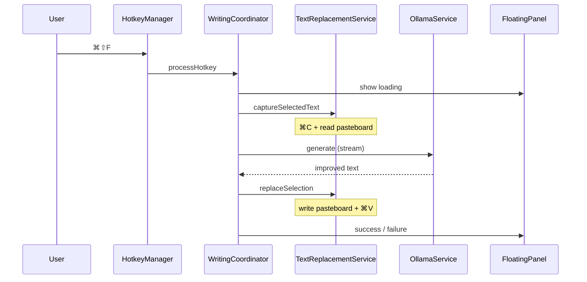

# VibeRite Architecture

## Overview

VibeRite is a macOS 14+ SwiftUI application that improves user-selected text using a **local Ollama HTTP API**. The MVP prioritizes stability, privacy, and native integration over feature breadth.

## Design Principles

1. **Local-only AI** — `OllamaService` talks exclusively to `localhost:11434`.
2. **Accessibility-safe text IO** — Selection is captured via temporary ⌘C/⌘V with pasteboard snapshots restored after each operation.
3. **Thin UI, thick services** — Business logic lives in `Services/`; SwiftUI views remain declarative.
4. **Future-ready seams** — `AppSettings`, `WritingAction`, and coordinator-based pipelines support menu bar mode, custom prompts, and history without rewrites.

## Component Responsibilities

| Component | Role |
|-----------|------|
| `HotkeyManager` | Registers global **⌘⇧F** using Carbon `RegisterEventHotKey`. |
| `ContextMenuManager` | Registers `NSServices` provider for system-wide contextual actions. |
| `ClipboardManager` | Snapshots and restores `NSPasteboard` to avoid clobbering user clipboard data. |
| `AccessibilityManager` | Checks `AXIsProcessTrusted`, opens Settings, posts synthetic key events. |
| `TextReplacementService` | Capture → validate length → replace selection workflows. |
| `OllamaService` | Health check (`/api/tags`), streaming `/api/generate`, error mapping. |
| `PromptTemplateService` | Maps `WritingAction` → instruction strings and full prompts. |
| `PermissionsManager` | Observable permission state for onboarding UI. |
| `WritingCoordinator` | Single pipeline for hotkey and Services entry points. |
| `FloatingPanelController` | Non-activating `NSPanel` HUD near the cursor. |
| `MainViewModel` | MVVM bridge between SwiftUI and services. |

## Request Lifecycle (Hotkey)

## Request Lifecycle (Services)

macOS invokes an `@objc` method on `ServicesProvider` with the selected text already on the pasteboard. The provider blocks until `WritingCoordinator` finishes (run-loop spin) so the returned string is available to the host app.

## Tricky macOS APIs (comments in code)

- **Carbon hotkeys** — Still the most reliable global shortcut path without third-party dependencies.
- **CGEvent posting** — Requires Accessibility trust; uses combined session state for foreground app targeting.
- **NSServices** — `NSMessage` selectors must match `Info.plist`; submenu paths use `VibeRite/Action Name`.
- **Pasteboard snapshots** — Prevents VibeRite from permanently overwriting unrelated clipboard content.

## Sandboxing

App Sandbox is **disabled** for MVP so Accessibility automation and localhost networking behave predictably. `com.apple.security.network.client` remains in entitlements for hardened-runtime clarity.

## Extension Points

- Add menu bar agent: reuse `WritingCoordinator` + `HotkeyManager`.
- Custom prompts: extend `PromptTemplateService` with user-defined templates stored in `AppSettings`.
- Preview before replace: intercept between Ollama result and `replaceSelection`.
- History: append inputs/outputs in coordinator after success.
